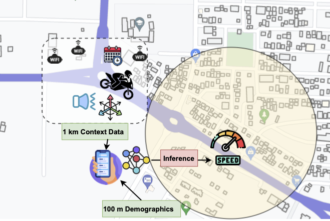
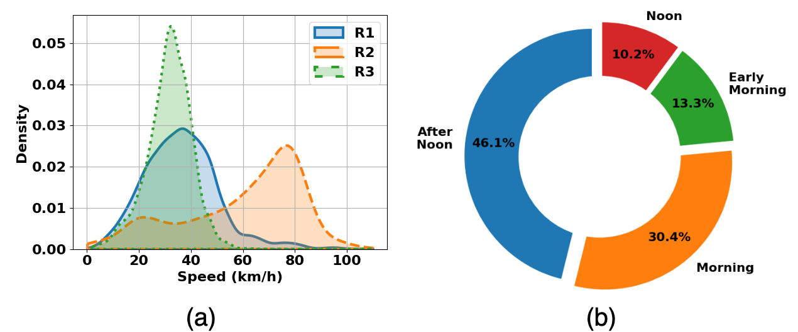
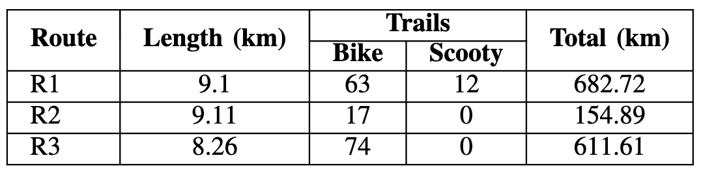

# <strong><em>Pathik</em></strong> Framework
Overspeeding is a significant cause of road accidents, especially when the target vehicle is a two-wheeler. Coupled with infrastructural limitations and the general reckless driving behavior, it becomes challenging to reduce the problem of overspending, mainly because the optimal speed depends not only on road types but also on several spatiotemporal contexts. To mitigate this, in this paper, we propose Pathik, which uses multimodal contextual information to accurately predict the speeding behavior of a bike driver for the next road segment. Pathik then aggregates this information with the demographic and map-based information for the next road segment and recommends decelerating if the bike speed exceeds. Principled evaluation on an in-house dataset with different bike types (both geared and gearless) shows that Pathik can accurately predict the speed for the next patch with a mean R2-score of 0.92 (+/- 0.015).
<p align="center">
      <br><strong>Fig.1: Pathik Framework</strong>
</p>

## Two-wheeler Dataset
We have collected the two-wheeler trails at Durgapur city in India for three routes: R1, R2, and R3. The Figure 2 (a) shows the speed distribution in each route. We observe that the average speed of R2 is higher as it goes through the highway. In total, six participants voluntarily took part in the data collection process, recording a total of $1448$ km trail from both bike and scooty as shown in Table 1. The Figure 2 (b) shows the data quantity for different times of day. The smartphone's sensor data is recorded with an open-source Android application available at [LoggerApp](https://github.com/prasenjit52282/LoggerApp).

<p align="center">
      <br>
      <strong>Fig. 2: Dataset: (a) Speed distribution, (b) Data quantity in times of day</strong>
</p>

<p align="center">
      <br>
      <strong>Table. 1: Collected dataset from three routes in Durgapur</strong>
</p>

## Installation

To install use the following commands.
```bash
git clone https://github.com/prasenjit52282/Pathik.git
pip install -r requirements.txt
```

## Directory Structure

```
Pathik
└── Output                         
└── Trails/TW                   /*-------Dataset--------*/
└── library
    └──(data processing py files)
└── logs
└── modellib
    └──(model related py files)
└── data_analysis.py
└── modelling-10fold.ipynb
└── modelling-tr2019-te2018.ipynb
└── modelling.ipynb
└── process_data.py
└── process_dataset.ipynb
└── requirements.txt
└── README.md
```

# Reference
This paper has been accepted in the Work-in-Progress track of IEEE PerCom 2024. You can download the preprint of the paper from [here](https://github.com/prasenjit52282/Pathik/blob/main/Pathik_PerCom2024_WIP.pdf).

BibTex Reference:
```
@inproceedings{karmakar2024multimodal,
  title={Multimodal Sensing for Predicting Real-time Biking Behavior based on Contextual Information},
  author={Karmakar, Prasenjit and Meena, Ajay Kumar and Natani, Kushal and Chakraborty, Sandip},
  booktitle={2024 IEEE International Conference on Pervasive Computing and Communications Workshops and other Affiliated Events (PerCom Workshops)},
  pages={441--444},
  year={2024},
  organization={IEEE}
}
```

For questions and general feedback, contact Prasenjit Karmakar (pkarmakar@kgpian.iitkgp.ac.in).
